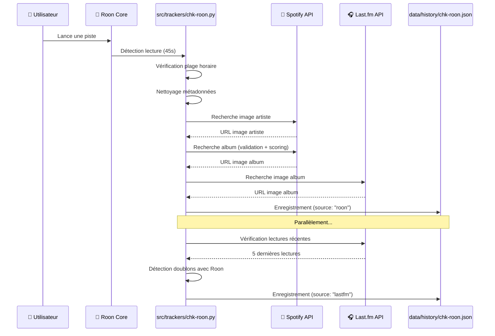
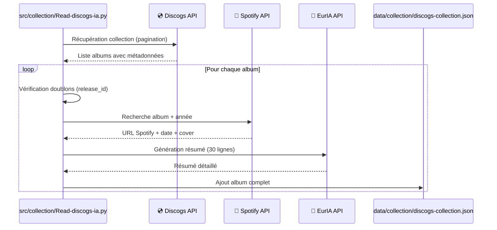
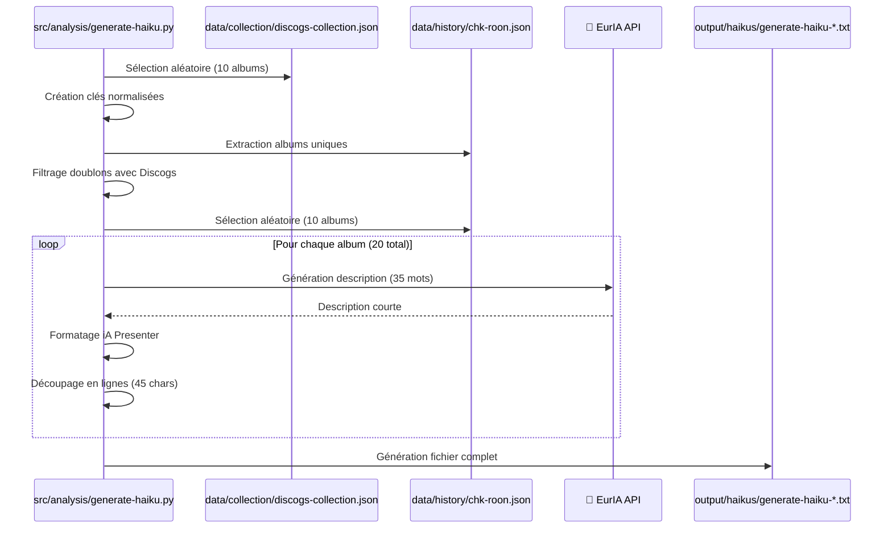
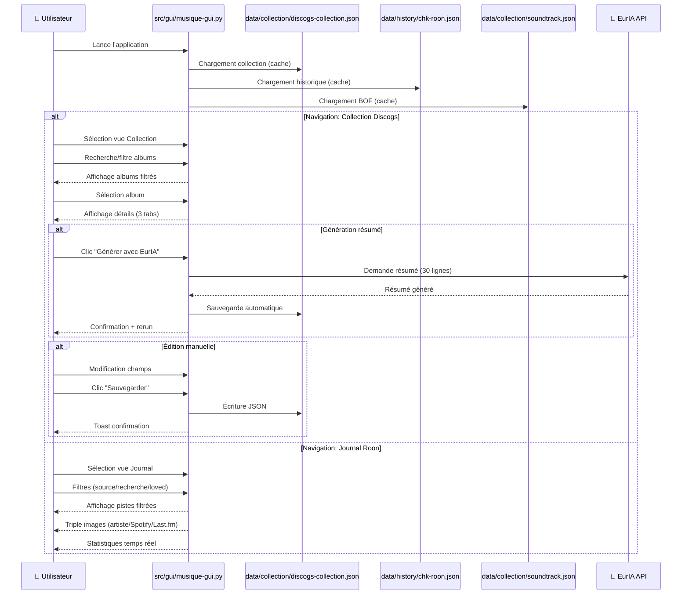
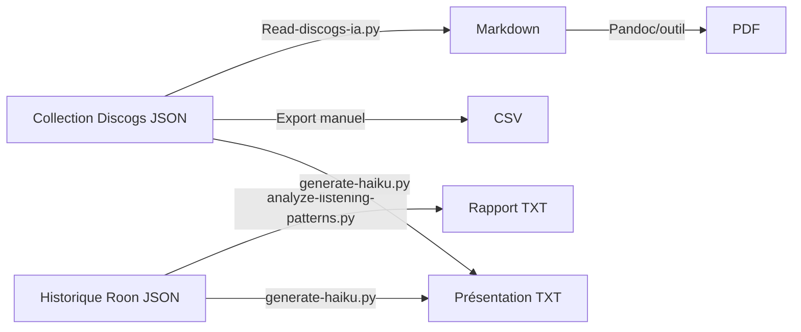

# 🎵 Architecture du Projet Musique - Vue d'ensemble

## 📊 Diagramme de flux principal

```mermaid
graph TB
    subgraph "Sources Externes"
        ROON[🎵 Roon Core<br/>Serveur Local]
        LASTFM[🎧 Last.fm API<br/>Lectures en ligne]
        DISCOGS[💿 Discogs API<br/>Collection]
        SPOTIFY[🎼 Spotify API<br/>Métadonnées]
        EURIA[🤖 EurIA API<br/>IA Génération]
        CINEMA[🎬 Cinéma/catalogue.json<br/>Métadonnées Films]
    end

    subgraph "Scripts de Surveillance"
        CHK_ROON[src/trackers/chk-roon.py<br/>v2.2.0<br/>Tracker Roon + Last.fm]
        CHK_LASTFM[src/trackers/chk-last-fm.py<br/>Tracker Last.fm seul]
    end

    subgraph "Données Centrales"
        ROON_JSON[(data/history/chk-roon.json<br/>📝 Historique<br/>des lectures)]
        DISCOGS_JSON[(data/collection/discogs-collection.json<br/>📚 Collection Discogs)]
        ROON_CONFIG[(data/config/roon-config.json<br/>⚙️ Configuration)]
        SOUNDTRACK_JSON[(data/collection/soundtrack.json<br/>🎬 BOF détectées)]
    end

    subgraph "Interfaces Utilisateur"
        STREAMLIT[src/gui/musique-gui.py<br/>v1.0.0<br/>🌐 Interface Web Streamlit]
    end

    subgraph "Scripts de Gestion Collection"
        READ_DISCOGS[src/collection/Read-discogs-ia.py<br/>Import Discogs]
    end

    subgraph "Scripts d'Enrichissement"
        COMPLETE_RESUME[src/enrichment/complete-resumes.py<br/>Résumés albums]
        COMPLETE_IMAGES[src/enrichment/complete-images-roon.py<br/>Images manquantes]
        NORMALIZE[src/enrichment/normalize-supports.py<br/>Normalisation formats]
    end

    subgraph "Scripts d'Analyse"
        ANALYZE[src/analysis/analyze-listening-patterns.py<br/>📈 Patterns écoute]
        GENERATE_HAIKU[src/analysis/generate-haiku.py<br/>v2.1.0<br/>🎨 Présentations]
        GENERATE_SOUNDTRACK[src/collection/generate-soundtrack.py<br/>🎬 BOF/Films]
    end

    subgraph "Sorties Finales"
        HAIKU_TXT[output/haikus/generate-haiku-*.txt<br/>📄 Présentation iA]
        PATTERNS_TXT[output/reports/listening-patterns-*.txt<br/>📊 Rapport analyse]
        DISCOGS_MD[data/exports/discogs-collection.md<br/>📝 Markdown export]
    end

    %% Connexions Sources -> Surveillance
    ROON -->|Découverte réseau| CHK_ROON
    LASTFM -->|API Lectures| CHK_ROON
    LASTFM -->|API Lectures| CHK_LASTFM
    
    %% Connexions APIs -> Scripts
    SPOTIFY -->|Images artistes/albums| CHK_ROON
    SPOTIFY -->|Images artistes/albums| CHK_LASTFM
    SPOTIFY -->|Métadonnées| READ_DISCOGS
    LASTFM -->|Images albums| CHK_ROON
    DISCOGS -->|Collection complète| READ_DISCOGS
    EURIA -->|Résumés IA| READ_DISCOGS
    EURIA -->|Descriptions courtes| GENERATE_HAIKU
    EURIA -->|Résumés détaillés| COMPLETE_RESUME
    EURIA -->|Génération résumé| STREAMLIT
    CINEMA -->|Métadonnées films| GENERATE_SOUNDTRACK

    %% Connexions Surveillance -> Données
    CHK_ROON -->|Enregistrement| ROON_JSON
    CHK_LASTFM -->|Enregistrement| ROON_JSON
    CHK_ROON <-->|Config| ROON_CONFIG
    
    %% Connexions Gestion Collection
    READ_DISCOGS -->|Création/MAJ| DISCOGS_JSON
    
    %% Connexions Interface Streamlit
    STREAMLIT <-->|Lecture/Édition| DISCOGS_JSON
    STREAMLIT -->|Lecture| ROON_JSON
    STREAMLIT -->|Lecture| SOUNDTRACK_JSON
    STREAMLIT -->|Sauvegarde| DISCOGS_JSON
    
    %% Connexions Enrichissement
    ROON_JSON -->|Lecture| COMPLETE_IMAGES
    COMPLETE_IMAGES -->|Mise à jour| ROON_JSON
    DISCOGS_JSON -->|Lecture| COMPLETE_RESUME
    COMPLETE_RESUME -->|Mise à jour| DISCOGS_JSON
    DISCOGS_JSON -->|Lecture| NORMALIZE
    NORMALIZE -->|Mise à jour| DISCOGS_JSON
    
    %% Connexions Analyse
    ROON_JSON -->|Lecture| ANALYZE
    ANALYZE -->|Génération| PATTERNS_TXT
    DISCOGS_JSON -->|10 albums aléatoires| GENERATE_HAIKU
    ROON_JSON -->|10 albums aléatoires| GENERATE_HAIKU
    GENERATE_HAIKU -->|Génération| HAIKU_TXT
    DISCOGS_JSON -->|Export| DISCOGS_MD
    DISCOGS_JSON -->|Lecture albums| GENERATE_SOUNDTRACK
    CINEMA -->|Lecture films| GENERATE_SOUNDTRACK
    GENERATE_SOUNDTRACK -->|Génération| SOUNDTRACK_JSON

    %% Styles
    classDef apiClass fill:#e1f5ff,stroke:#01579b,stroke-width:2px
    classDef scriptClass fill:#fff9c4,stroke:#f57f17,stroke-width:2px
    classDef dataClass fill:#f3e5f5,stroke:#4a148c,stroke-width:2px
    classDef outputClass fill:#e8f5e9,stroke:#1b5e20,stroke-width:2px
    classDef guiClass fill:#ffe0b2,stroke:#e65100,stroke-width:3px
    
    class ROON,LASTFM,DISCOGS,SPOTIFY,EURIA,CINEMA apiClass
    class CHK_ROON,CHK_LASTFM,READ_DISCOGS,COMPLETE_RESUME,COMPLETE_IMAGES,NORMALIZE,ANALYZE,GENERATE_HAIKU,GENERATE_SOUNDTRACK scriptClass
    class ROON_JSON,DISCOGS_JSON,ROON_CONFIG,SOUNDTRACK_JSON dataClass
    class HAIKU_TXT,PATTERNS_TXT,DISCOGS_MD outputClass
    class STREAMLIT guiClass
```




## 🗂️ Organisation des dossiers (v3.0.0)

```
Musique/
├── 📂 src/                          # Code source Python organisé par fonction
│   ├── trackers/                    # Scripts de surveillance temps réel
│   │   ├── chk-roon.py (v2.2.0) ⭐ Tracker Roon + Last.fm combiné
│   │   │   → Recherche URLs d'images publiques (Spotify, Last.fm)
│   │   │   → Permet traitement ultérieur par IA sans accès Roon
│   │   └── chk-last-fm.py ⭐ Tracker Last.fm standalone
│   │
│   ├── collection/                  # Gestion de la collection musicale
│   │   ├── Read-discogs-ia.py ⭐ Import collection Discogs + enrichissement IA
│   │   └── generate-soundtrack.py ⭐ Détection bandes originales (BOF)
│   │
│   ├── enrichment/                  # Enrichissement métadonnées
│   │   ├── complete-resumes.py → Génération résumés manquants (EurIA)
│   │   ├── complete-images-roon.py → Complétion images Spotify/Last.fm
│   │   └── normalize-supports.py → Normalisation formats (Vinyle/CD)
│   │
│   ├── analysis/                    # Analyse et génération de rapports
│   │   ├── analyze-listening-patterns.py → Analyse patterns d'écoute
│   │   └── generate-haiku.py (v2.1.0) ⭐ Générateur présentations IA
│   │
│   ├── maintenance/                 # Nettoyage et maintenance
│   │   ├── remove-consecutive-duplicates.py → Suppression doublons
│   │   ├── fix-radio-tracks.py → Correction métadonnées radio
│   │   └── clean-radio-tracks.py → Nettoyage lectures radio invalides
│   │
│   ├── utils/                       # Utilitaires divers
│   │   ├── List_all_music_on_drive.py → Inventaire fichiers musicaux
│   │   └── test-spotify-search-v2.2.py → Tests API Spotify
│   │
│   └── gui/                         # Interface utilisateur
│       └── musique-gui.py (v1.0.0) ⭐⭐ Interface Web Streamlit (principale)
│
├── 📂 data/                         # Données JSON actives
│   ├── config/                      # Configuration et credentials
│   │   ├── .env ⭐ Clés API (non versionné)
│   │   ├── roon-config.json → Configuration Roon
│   │   └── Liste_sites_musique-favoris.json → Favoris web
│   │
│   ├── collection/                  # Collection musicale
│   │   ├── discogs-collection.json ⭐ Collection Discogs complète
│   │   └── soundtrack.json → Liste bandes originales détectées
│   │
│   ├── history/                     # Historique des lectures
│   │   ├── chk-roon.json ⭐ Historique Roon + Last.fm (source principale)
│   │   ├── chk-roon.lock → Verrou processus (instance unique)
│   │   └── chk-last-fm.json → Cache Last.fm standalone
│   │
│   └── exports/                     # Exports formatés
│       ├── discogs-collection.md → Export Markdown collection
│       ├── discogs-collection.pdf → Export PDF collection
│       ├── Collection-discogs.csv → Export CSV Discogs
│       └── list_all_music.csv → Inventaire fichiers drive
│
├── 📂 output/                       # Fichiers générés temporaires
│   ├── haikus/                      # Présentations musicales IA
│   │   └── generate-haiku-YYYYMMDD-HHMMSS.txt
│   └── reports/                     # Rapports d'analyse
│       └── listening-patterns-YYYYMMDD-HHMMSS.txt
│
├── 📂 backups/                      # Sauvegardes organisées
│   ├── json/                        # Backups JSON horodatés
│   │   ├── chk-roon/               → Backups historique lectures
│   │   ├── discogs-collection/     → Backups collection
│   │   └── soundtrack/             → Backups soundtracks
│   ├── python/                      # Backups scripts Python
│   │   └── backup-YYYYMMDD-HHMMSS/
│   └── legacy/                      # Ancienne structure (pré-v3.0)
│
├── 📂 docs/                         # Documentation centralisée
│   ├── README-ROON-TRACKER.md ⭐ Guide complet tracker
│   ├── README-MUSIQUE-GUI.md ⭐ Guide interface Streamlit
│   ├── README-ROON-CONFIG.md → Configuration roon-config.json
│   ├── README-GENERATE-HAIKU.md → Guide générateur haiku
│   ├── ARCHITECTURE-OVERVIEW.md ⭐ Ce document
│   ├── CHANGELOG-v2.2.0.md → Changements tracker v2.2.0
│   └── CHANGELOG-generate-haiku-v2.1.0.md → Changements haiku
│
├── 📂 resources/                    # Ressources du projet
│   ├── prompts/                     # Spécifications et prompts IA
│   │   └── PROMPT-ROON-TRACKER-v2.2.0.md
│   └── images/                      # Diagrammes et illustrations
│       └── ROON LASTFM DISCOGS Pipeline-*.png
│
├── 📂 scripts/                      # Scripts shell d'administration
│   ├── setup-roon-tracker.sh → Installation complète environnement
│   ├── start-streamlit.sh → Lancement interface Web
│   └── update_python_certificates.sh → Mise à jour certificats SSL
│
├── 📂 samples/                      # Exemples de documents générés
│   ├── discogs-collection.md → Exemple export Markdown collection
│   └── listening-patterns-*.txt → Exemple rapport analyse d'écoute
│
├── 📂 archive/                      # Archives et code expérimental
│   └── Autres codes python/ → Scripts expérimentaux
│
├── .github/
│   └── copilot-instructions.md ⭐ Instructions pour IA Copilot
│
├── 📋 Fichiers racine
│   ├── start-roon-tracker.sh ⭐ Lanceur tracker (wrapper)
│   ├── requirements-roon.txt → Dépendances Python
│   ├── README.md ⭐ Documentation principale
│   ├── MIGRATION-GUIDE.md → Guide migration v3.0.0
│   ├── REORGANISATION-COMPLETE.txt → Synthèse réorganisation
│   └── .gitignore → Protection fichiers sensibles
│
└── .venv/ → Environnement virtuel Python (non versionné)
```

### 🎯 Principes d'organisation (v3.0.0)

**Séparation stricte:**
- **`src/`**: Code source uniquement (aucune donnée)
- **`data/`**: Données JSON actives (config, collection, historique, exports)
- **`output/`**: Fichiers temporaires générés (haikus, rapports)
- **`backups/`**: Sauvegardes horodatées organisées par type
- **`docs/`**: Documentation complète centralisée
- **`resources/`**: Ressources statiques (prompts, images)
- **`scripts/`**: Scripts shell d'administration
- **`samples/`**: Exemples de documents produits par le système

**Modularité fonctionnelle:**
- Trackers → Surveillance temps réel
- Collection → Gestion collection musicale
- Enrichment → Ajout métadonnées
- Analysis → Rapports et insights
- Maintenance → Nettoyage et corrections
- GUI → Interface utilisateur

**Chemins relatifs robustes:**
- Tous les scripts utilisent chemins relatifs depuis leur emplacement
- Format standard: `../../data/collection/discogs-collection.json`
- Configuration: `../../data/config/.env`
- Outputs: `../../output/haikus/`

## 🔄 Flux de données détaillés

### 1. Surveillance des lectures musicales



### 2. Import et enrichissement collection Discogs



### 3. Génération de présentations haïku



### 4. Interface Web Streamlit (musique-gui.py v1.0.0)



## 📦 Modules et responsabilités

### Scripts de surveillance (Temps réel)

| Script | Emplacement | Fonction principale | Fréquence | Output |
|--------|-------------|-------------------|-----------|--------|
| `chk-roon.py` | `src/trackers/` | Surveillance Roon + Last.fm combinée | 45s (Roon) | `data/history/chk-roon.json` |
| `chk-last-fm.py` | `src/trackers/` | Surveillance Last.fm standalone | À la demande | `data/history/chk-last-fm.json` |

### Scripts de collection (À la demande)

| Script | Emplacement | Fonction principale | Input | Output |
|--------|-------------|-------------------|-------|--------|
| `Read-discogs-ia.py` | `src/collection/` | Import complet collection Discogs | Discogs API | `data/collection/discogs-collection.json` |
| `musique-gui.py` (v2.1) | `src/gui/` | Interface Web Streamlit complète | Discogs + Roon + Soundtrack JSON | `data/collection/discogs-collection.json` |
| `generate-soundtrack.py` | `src/collection/` | Détection BOF (cross-check cinéma) | Discogs + Cinéma JSON | `data/collection/soundtrack.json` |

### Scripts d'enrichissement (Maintenance)

| Script | Emplacement | Fonction principale | Input | Output |
|--------|-------------|-------------------|-------|--------|
| `complete-resumes.py` | `src/enrichment/` | Génère résumés manquants (EurIA) | `data/collection/discogs-collection.json` | MAJ JSON |
| `complete-images-roon.py` | `src/enrichment/` | Complète images null (Spotify/Last.fm) | `data/history/chk-roon.json` | MAJ JSON |
| `normalize-supports.py` | `src/enrichment/` | Normalise formats → Vinyle/CD | `data/collection/discogs-collection.json` | MAJ JSON |

### Scripts d'analyse (Insights)

| Script | Emplacement | Fonction principale | Input | Output |
|--------|-------------|-------------------|-------|--------|
| `analyze-listening-patterns.py` | `src/analysis/` | Analyse sessions, albums, corrélations | `data/history/chk-roon.json` | `output/reports/listening-patterns-*.txt` |
| `generate-haiku.py` | `src/analysis/` | Présentation iA avec descriptions IA | Discogs + Roon JSON | `output/haikus/generate-haiku-*.txt` |

### Scripts de maintenance (Nettoyage)

| Script | Emplacement | Fonction principale | Input | Output |
|--------|-------------|-------------------|-------|--------|
| `remove-consecutive-duplicates.py` | `src/maintenance/` | Suppression doublons consécutifs | `data/history/chk-roon.json` | MAJ JSON + Backup |
| `fix-radio-tracks.py` | `src/maintenance/` | Correction métadonnées pistes radio | `data/history/chk-roon.json` | MAJ JSON |
| `clean-radio-tracks.py` | `src/maintenance/` | Nettoyage lectures radio invalides | `data/history/chk-roon.json` | MAJ JSON |

## 🌐 Interface Web Streamlit (musique-gui.py v2.1)

### Fonctionnalités principales

#### Vue Collection Discogs
- 🔍 **Recherche et filtrage**
  - Recherche textuelle (titre, artiste)
  - Filtre spécifique bandes originales (🎬)
  - Compteurs dynamiques (total albums, BOF)

- 📝 **Édition en ligne**
  - 3 onglets : Informations | Images | Liens
  - Modification tous champs métadonnées
  - **Génération résumé EurIA** intégrée (bouton)
  - Sauvegarde JSON automatique
  - Toast de confirmation

- 🖼️ **Gestion des images**
  - Double affichage : Discogs + Spotify
  - Édition URLs images inline
  - Preview images responsive

- 🔗 **Liens externes**
  - Bouton play Spotify direct
  - Lien Discogs (release_id)
  - URLs modifiables

- 🎬 **Métadonnées films (BOF)**
  - Badge "SOUNDTRACK / BANDE ORIGINALE"
  - Titre film, année, réalisateur
  - Cross-référence avec catalogue cinéma

#### Vue Journal Roon
- 📻 **Historique des écoutes**
  - Affichage chronologique inversé
  - Source : Roon ou Last.fm (filtre)
  - Marquage favoris (❤️)

- 🖼️ **Triple affichage images**
  - Image artiste (Spotify) - 100px
  - Pochette album (Spotify) - 100px
  - Pochette album (Last.fm) - 100px
  - URLs visibles dans expandeurs

- 🔍 **Filtres multiples**
  - Recherche textuelle (artiste, titre, album)
  - Filtre source (Toutes, Roon, Last.fm)
  - Filtre favoris (checkbox "Seulement ❤️")

- 📊 **Statistiques temps réel**
  - Total lectures
  - Lectures Roon
  - Lectures Last.fm
  - Favoris

### Architecture technique

#### Layout Streamlit
```
┌─────────────────────────────────────────────────────────────┐
│ SIDEBAR                    │ MAIN ZONE                      │
├────────────────────────────┼────────────────────────────────┤
│ 🎵 Navigation              │ Content dynamique              │
│ ○ Collection Discogs       │ (Collection ou Journal)        │
│ ○ Journal Roon             │                                │
│                            │ • Filtres                      │
│ [Si Collection:]           │ • Liste albums/pistes          │
│ 📚 Albums                  │ • Détails sélection           │
│ Total: 500  🎬 BOF: 42     │ • Tabs (Collection)           │
│ 🔍 Rechercher...           │ • Statistiques (Journal)      │
│ ☑ Seulement Soundtracks   │                                │
│ • Album 1                  │                                │
│ • Album 2                  │                                │
│ • ...                      │                                │
└────────────────────────────┴────────────────────────────────┘
```

#### Cache Streamlit
```python
@st.cache_data
def load_data() -> List[Dict]:
    # Discogs collection - invalidé lors save
    
@st.cache_data  
def load_roon_data() -> List[Dict]:
    # Historique Roon - statique jusqu'à rerun
    
@st.cache_data
def load_soundtrack_data() -> List[Dict]:
    # Métadonnées films - statique
    
@st.cache_data(show_spinner=False)
def load_image_from_url(url: str) -> Optional[Image.Image]:
    # Images web - cache permanent
```

#### Gestion des clés (Streamlit)
- Clés uniques avec index album : `discogs_url_{index}`
- Évite corruption state avec duplicates
- Nécessaire pour champs multiples par album

#### CSS personnalisé
```css
/* Champs de saisie - fond gris clair */
.stTextInput, .stTextArea, .stNumberInput, .stSelectbox {
    background-color: #f0f2f6;
    color: #000000;
}

/* Journal Roon - interface compacte */
.roon-track h3 {
    font-size: 1.2rem;
    margin: 0.2rem 0;
}

.roon-track p {
    margin-bottom: 0.2rem;
    line-height: 1.2;
}

/* Dividers compacts */
hr {
    margin: 0.5rem 0;
}
```

### Optimisations v2.0-2.1
- 📏 **Images réduites 4x** : 100px au lieu de pleine largeur
- 📐 **Layout repensé** : Texte gauche (2/3), images droite (1/3)
- 📉 **Hauteur lignes -50%** : Affichage plus dense
- 🎨 **Style unifié** : Fond gris, texte noir partout
- 🤖 **Génération IA intégrée** : Bouton EurIA dans onglet Info
- ⚡ **Performance** : Cache agressif, lazy load images

### Workflow utilisateur typique
1. **Lance Streamlit** : `./start-streamlit.sh`
2. **Navigation** : Radio button Collection/Journal
3. **Collection** :
   - Recherche album → Sélection sidebar
   - Consultation détails (3 tabs)
   - Édition métadonnées
   - Génération résumé EurIA (optionnel)
   - Sauvegarde
4. **Journal** :
   - Filtres source/recherche/favoris
   - Consultation historique
   - Visualisation triple images

### Intégration écosystème (v3.0.0)
```
src/trackers/chk-roon.py (v2.2.0) ──┬──► data/history/chk-roon.json ──┐
                                    │                                   │
src/trackers/chk-last-fm.py ────────┘                                   │
                                                                        ├──► src/gui/musique-gui.py (v2.1)
src/collection/Read-discogs-ia.py ───────► data/collection/discogs-collection.json ──┘    │
                                                                        │                  │
src/collection/generate-soundtrack.py ──► data/collection/soundtrack.json ──┘             ▼
                                                                        Affichage Web + Édition
                                                                              │
                                                                              ├──► data/collection/discogs-collection.json
                                                                              └──► Sauvegarde automatique
```

## 🔑 APIs et authentification

### Spotify Web API
- **Type**: OAuth 2.0 Client Credentials
- **Usage**: Images artistes/albums, métadonnées
- **Cache**: Token valide 3600s (refresh -60s)
- **Rate limit**: Géré avec retry automatique (401, 429)

### Last.fm API
- **Type**: API Key simple
- **Usage**: Images albums, lectures récentes
- **Cache**: Par (artiste, album)
- **Rate limit**: Non restrictif

### Discogs API
- **Type**: API Key avec token
- **Usage**: Collection complète, métadonnées détaillées
- **Rate limit**: 60 req/min (authenticated), pagination 100/page

### EurIA API (Infomaniak)
- **Type**: Bearer token
- **Modèle**: Qwen3 avec web search
- **Usage**: Résumés albums, descriptions courtes
- **Rate limit**: Géré avec max_attempts

### Roon API
- **Type**: Token propriétaire (découverte mDNS)
- **Usage**: Surveillance temps réel lectures
- **Auth**: Autorisation manuelle dans Roon UI

## 🛡️ Sécurité et robustesse

### Fichiers de configuration
- ✅ `.env` dans `.gitignore` (credentials jamais versionnés)
- ✅ `roon-config.json` auto-généré (token Roon)
- ✅ Validation des clés API au démarrage

### Protection des données
- ✅ Backups automatiques avant modifications (JSON)
- ✅ Dossier `Anciennes versions/` avec horodatage
- ✅ Dossier `backup-python/` pour scripts modifiés
- ✅ Politique de rétention: 5 derniers backups

### Gestion des erreurs
- ✅ Try/except sur toutes les requêtes réseau
- ✅ Retry automatique avec backoff (Spotify 401/429)
- ✅ Messages d'erreur informatifs avec émojis
- ✅ Réparation automatique images null au démarrage
- ✅ Verrouillage fcntl (une seule instance chk-roon.py)

## 📈 Évolutions récentes

### Version 2.1 (musique-gui.py) - 21 janvier 2026
- ✨ **Interface Web Streamlit** moderne et responsive
- ✨ **Génération de résumés** via EurIA API intégrée dans l'interface
- ✨ **Double vue** : Collection Discogs + Journal Roon
- ✨ **Filtrage avancé** : Recherche, soundtracks (BOF), sources, favoris
- ✨ **Triple affichage images** dans le journal (artiste/Spotify/Last.fm)
- ✨ **Édition en ligne** avec sauvegarde JSON automatique
- ✨ **Statistiques temps réel** sur les écoutes
- ✨ **Interface compacte** : Images 100px, hauteur lignes réduite de 50%
- 🎨 **Style unifié** : Fond gris clair, texte noir, espacement optimisé
- 🔗 **Liens directs** vers Spotify et Discogs
- 📊 **Métadonnées films** pour bandes originales

### Version 2.2.0 (chk-roon.py) - 21 janvier 2026
- ✨ **Validation stricte d'artiste** avec `artist_matches()` (tolérance)
- ✨ **Système de scoring** pour albums (100/80/50 points)
- ✨ **Retry automatique** sur erreurs 401 (token expiré) et 429 (rate limit)
- ✨ **5 résultats** au lieu d'un seul pour meilleur matching
- 🔧 Normalisation pour comparaison insensible à la casse

### Version 2.1.0 (generate-haiku.py) - 20 janvier 2026
- ✨ **Détection de doublons** entre Discogs et Roon
- ✨ **Clés normalisées** pour comparaison albums
- 📊 Statistiques détaillées dans l'output
- 🎲 Utilisation de `secrets.SystemRandom()` (sécurisé)

### Version 2.1.0 (chk-roon.py) - 18 janvier 2026
- ✨ **Réparation automatique** images null au démarrage
- 🛡️ **Verrouillage fcntl** (instances multiples)
- 🎧 **Intégration Last.fm** dans le tracker principal
- 🏷️ **Marquage de source** ("roon" ou "lastfm")

## 🎯 Workflows typiques (v3.0.0)

### 1. Démarrage journalier du tracker
```bash
# Méthode 1: Wrapper racine (recommandé)
cd ~/Documents/DataForIA/Musique
./start-roon-tracker.sh

# Méthode 2: Direct depuis src/
cd ~/Documents/DataForIA/Musique/src/trackers
source ../../.venv/bin/activate
python3 chk-roon.py

# → Surveillance continue jusqu'à Ctrl+C
# → Fichier: data/history/chk-roon.json
# → Lock: data/history/chk-roon.lock
```

### 2. Lancement interface Web Streamlit
```bash
# Méthode 1: Script shell (recommandé)
cd ~/Documents/DataForIA/Musique
./scripts/start-streamlit.sh

# Méthode 2: Direct
cd ~/Documents/DataForIA/Musique
source .venv/bin/activate
streamlit run src/gui/musique-gui.py

# → Interface Web sur http://localhost:8501
# → Navigation : Collection Discogs + Journal Roon
# → Édition en ligne avec sauvegarde
```

### 3. Import nouvelle collection Discogs
```bash
cd ~/Documents/DataForIA/Musique/src/collection
source ../../.venv/bin/activate
python3 Read-discogs-ia.py

# → Input: Discogs API
# → Output: data/collection/discogs-collection.json
# → Enrichissement automatique complet (Spotify + EurIA)
```

### 4. Génération présentation haïku
```bash
cd ~/Documents/DataForIA/Musique/src/analysis
source ../../.venv/bin/activate
python3 generate-haiku.py

# → Input: data/collection/discogs-collection.json
#          data/history/chk-roon.json
# → Output: output/haikus/generate-haiku-YYYYMMDD-HHMMSS.txt
# → Format: iA Presenter
```

### 5. Maintenance des données
```bash
cd ~/Documents/DataForIA/Musique
source .venv/bin/activate

# Compléter images manquantes
cd src/enrichment && python3 complete-images-roon.py
# → Input/Output: data/history/chk-roon.json

# Compléter résumés manquants
cd src/enrichment && python3 complete-resumes.py
# → Input/Output: data/collection/discogs-collection.json

# Normaliser supports
cd src/enrichment && python3 normalize-supports.py
# → Input/Output: data/collection/discogs-collection.json

# Supprimer doublons consécutifs
cd src/maintenance && python3 remove-consecutive-duplicates.py
# → Input/Output: data/history/chk-roon.json
# → Backup: backups/json/chk-roon/chk-roon-YYYYMMDD-HHMMSS.json
```

### 6. Analyse patterns d'écoute
```bash
cd ~/Documents/DataForIA/Musique/src/analysis
source ../../.venv/bin/activate
python3 analyze-listening-patterns.py

# → Input: data/history/chk-roon.json
# → Output: output/reports/listening-patterns-YYYYMMDD-HHMMSS.txt
# → Analyses: sessions, albums complets, patterns temporels, corrélations
```

### 7. Détection bandes originales (BOF)
```bash
cd ~/Documents/DataForIA/Musique/src/collection
source ../../.venv/bin/activate
python3 generate-soundtrack.py

# → Input: ../../data/collection/discogs-collection.json
#          ../../../Cinéma/catalogue.json (EXTERNE - requis)
# → Output: ../../data/collection/soundtrack.json
# → Cross-référence films ↔ albums
```

**⚠️ Dépendance externe:**
Ce script nécessite le projet Cinéma (`../../../Cinéma/catalogue.json`).

Structure de répertoires attendue:
```
Documents/DataForIA/
├── Cinéma/                    ← Projet externe (requis)
│   └── catalogue.json         ← Métadonnées films TMDB
│
└── Musique/                   ← Ce projet
    └── src/collection/
        └── generate-soundtrack.py
```

Si `catalogue.json` absent → `FileNotFoundError`.

## 📂 Exemples de documents produits

### Répertoire `samples/`

Le répertoire `samples/` contient des **exemples de documents générés** par le système, illustrant les différents formats de sortie (JSON, Markdown, PDF). Ces exemples servent de **référence** pour comprendre la structure et le contenu des fichiers produits par les scripts d'analyse et d'export.

#### Documents disponibles

**1. Export Markdown de collection (`discogs-collection.md`)**
- **Source**: Généré par `Read-discogs-ia.py` via `generate_markdown_from_json()`
- **Format**: Markdown structuré avec images et métadonnées
- **Contenu**: 
  - Albums groupés par artiste (titres de niveau 1)
  - Chaque album en sous-section (niveau 2)
  - Métadonnées complètes (année, labels, support, résumé)
  - Images: priorité à Spotify, fallback sur Discogs
  - Liens Spotify et Discogs
- **Structure type**:
  ```markdown
  # AIR
  
  ## Original Motion Picture Score For The Virgin Suicides
  
  **Artiste:** AIR
  - **Année:** 2000
  - **Labels:** Virgin, Virgin
  - **Support:** CD
  - **Résumé:** [Texte long généré par EurIA API]
  
  **Spotify:** [Lien](https://open.spotify.com/album/...)
  
  
  ```
- **Usage**: Export pour consultation hors-ligne, partage, archivage
- **Conversion**: Peut être converti en PDF avec Pandoc ou autres outils Markdown

**2. Rapport d'analyse patterns d'écoute (`listening-patterns-*.txt`)**
- **Source**: Généré par `analyze-listening-patterns.py`
- **Format**: Texte brut avec formatage ASCII
- **Contenu**:
  - **Sessions d'écoute**: Détection périodes continues, durée estimée
  - **Albums complets**: Albums écoutés avec 5+ pistes
  - **Patterns temporels**: Heures/jours préférés, distribution horaire
  - **Corrélations artistes**: Artistes écoutés dans mêmes sessions
  - **Transitions fréquentes**: Enchaînements artistes
  - **Statistiques globales**: Durée totale, diversité, artistes uniques
- **Structure type**:
  ```
  ================================================================================
  📊 ANALYSE DES PATTERNS D'ÉCOUTE
  ================================================================================
  
  🎵 SESSIONS D'ÉCOUTE
  Nombre total de sessions : 39
  Top 5 sessions les plus longues :
    1. 24 pistes (~96 min) - Début: 2026-01-17 11:43
  
  💿 ALBUMS ÉCOUTÉS EN ENTIER (5+ pistes)
    1. David Bowie - Lodger - 14 pistes
  
  ⏰ PATTERNS TEMPORELS
  Distribution par tranche horaire :
    12h-15h  : ████████████████████████████████████████ 95
  ```
- **Usage**: Analyse comportement d'écoute, insights musicaux
- **Horodatage**: Nom de fichier avec timestamp pour historique

#### Formats de sortie du système

Le système produit plusieurs types de documents selon le script utilisé :

| Format | Script générateur | Localisation sortie | Description |
|--------|-------------------|---------------------|-------------|
| **Markdown** | `Read-discogs-ia.py` | `data/exports/discogs-collection.md` | Export collection avec images |
| **CSV** | Export manuel | `data/exports/Collection-discogs.csv` | Données tabulaires collection |
| **PDF** | Conversion externe | `data/exports/discogs-collection.pdf` | Version imprimable collection |
| **TXT** (Haiku) | `generate-haiku.py` | `output/haikus/generate-haiku-*.txt` | Présentations iA Presenter |
| **TXT** (Patterns) | `analyze-listening-patterns.py` | `output/reports/listening-patterns-*.txt` | Rapports analytics |
| **JSON** | Tous les scripts | `data/collection/`, `data/history/` | Données structurées brutes |

#### Workflow de génération



#### Cas d'usage

- **Consultation hors-ligne**: Markdown/PDF pour lecture sans application
- **Partage**: Envoyer rapports patterns ou présentations haïku
- **Archivage**: Snapshots périodiques en Markdown/PDF
- **Analyse**: Rapports TXT pour insights comportement musical
- **Présentation**: Fichiers haïku formatés pour iA Presenter
- **Import externe**: CSV pour Excel, Google Sheets, PowerBI

#### Notes techniques

- **Encodage**: UTF-8 pour tous les fichiers (support caractères spéciaux)
- **Images**: URLs externes (Spotify CDN, Last.fm CDN, Discogs)
- **Formatage Markdown**: Compatible GitHub, Pandoc, iA Writer
- **ASCII art**: Graphiques barres dans rapports TXT (pas d'Unicode étendu)
- **Horodatage**: Format `YYYYMMDD-HHMMSS` pour versioning automatique

---

## 📂 Structure des données (v3.0.0)

### Fichiers de configuration
```
data/config/
├── .env                    # Credentials API (non versionné)
│   ├── SPOTIFY_CLIENT_ID
│   ├── SPOTIFY_CLIENT_SECRET
│   ├── API_KEY            # Last.fm
│   ├── API_SECRET         # Last.fm
│   ├── LASTFM_USERNAME
│   ├── DISCOGS_API_KEY
│   ├── DISCOGS_USERNAME
│   ├── URL                # EurIA API
│   └── bearer             # EurIA token
│
├── roon-config.json       # Configuration Roon
│   ├── token              # Auto-généré
│   ├── host               # Auto-découvert
│   ├── port               # Auto-découvert
│   ├── listen_start_hour  # 6 (configurable)
│   ├── listen_end_hour    # 23 (configurable)
│   └── radio_stations     # Array de stations
│
└── Liste_sites_musique-favoris.json
```

### Fichiers de collection
```
data/collection/
├── discogs-collection.json    # Collection complète
│   └── Array[Album]
│       ├── release_id         # ID unique Discogs
│       ├── Titre
│       ├── Artiste            # Array
│       ├── Année
│       ├── Labels             # Array
│       ├── Support            # "Vinyle" | "CD"
│       ├── Pochette           # URL Discogs
│       ├── Resume             # Texte long (EurIA)
│       ├── Spotify_URL
│       ├── Spotify_Date
│       └── Spotify_Cover_URL
│
└── soundtrack.json            # BOF détectées
    └── Array[BOF]
        ├── film_title         # Titre original film
        ├── album_title        # Titre album
        ├── year               # Année production
        └── director           # Réalisateur
```

### Fichiers d'historique
```
data/history/
├── chk-roon.json             # Historique complet lectures
│   └── {
│       "tracks": Array[Track]
│           ├── timestamp      # Unix timestamp
│           ├── date           # "YYYY-MM-DD HH:MM"
│           ├── artist
│           ├── title
│           ├── album
│           ├── loved          # Boolean
│           ├── artist_spotify_image
│           ├── album_spotify_image
│           ├── album_lastfm_image
│           └── source         # "roon" | "lastfm"
│       }
│
├── chk-roon.lock             # Verrou processus (PID)
│
└── chk-last-fm.json          # Cache Last.fm standalone
```

### Fichiers de sortie
```
output/
├── haikus/
│   └── generate-haiku-YYYYMMDD-HHMMSS.txt    # Format iA Presenter
│
└── reports/
    └── listening-patterns-YYYYMMDD-HHMMSS.txt # Rapport analyse
```

### Backups automatiques
```
backups/
├── json/
│   ├── chk-roon/
│   │   └── chk-roon-YYYYMMDD-HHMMSS.json
│   ├── discogs-collection/
│   │   └── discogs-collection-YYYYMMDD-HHMMSS.json
│   └── soundtrack/
│       └── soundtrack-YYYYMMDD-HHMMSS.json
│
├── python/
│   └── backup-YYYYMMDD-HHMMSS/              # Backups scripts modifiés
│
└── legacy/                                   # Ancienne structure (pré-v3.0)
    └── [Contenu pré-réorganisation]
```

## 📚 Documentation complète

- **Documentation principale**: [README.md](../README.md) - Guide complet v3.0.0
- **Guide migration**: [MIGRATION-GUIDE.md](../MIGRATION-GUIDE.md) - Migration v3.0.0
- **Interface Web Streamlit**: [README-MUSIQUE-GUI.md](README-MUSIQUE-GUI.md)
- **Tracker Roon**: [README-ROON-TRACKER.md](README-ROON-TRACKER.md)
- **Configuration Roon**: [README-ROON-CONFIG.md](README-ROON-CONFIG.md)
- **Générateur Haïku**: [README-GENERATE-HAIKU.md](README-GENERATE-HAIKU.md)
- **Prompts IA**: [../resources/prompts/PROMPT-ROON-TRACKER-v2.2.0.md](../resources/prompts/PROMPT-ROON-TRACKER-v2.2.0.md)
- **Changelogs**: 
  - [CHANGELOG-v2.2.0.md](CHANGELOG-v2.2.0.md) - Tracker Roon v2.2.0
  - [CHANGELOG-generate-haiku-v2.1.0.md](CHANGELOG-generate-haiku-v2.1.0.md) - Haiku v2.1.0
- **Instructions IA**: [../.github/copilot-instructions.md](../.github/copilot-instructions.md)

## 📈 Évolutions récentes

### Version 3.0.0 (Architecture) - 23 janvier 2026
- 🎯 **Réorganisation complète** en structure modulaire
- 📁 **Séparation stricte** : `src/` (code), `data/` (données), `output/` (fichiers générés)
- 🔧 **Modularité fonctionnelle** : trackers, collection, enrichment, analysis, maintenance
- 📂 **Backups organisés** : par type et horodatage
- 📚 **Documentation centralisée** dans `docs/`
- 🔄 **Chemins relatifs robustes** : tous les scripts utilisent `../../`
- 🚀 **Scripts wrapper** : `start-roon-tracker.sh` à la racine
- ✨ **15 scripts déplacés**, **100+ chemins mis à jour**

### Version 2.1 (musique-gui.py) - 21 janvier 2026
- ✨ **Interface Web Streamlit** moderne et responsive
- ✨ **Génération de résumés** via EurIA API intégrée dans l'interface
- ✨ **Double vue** : Collection Discogs + Journal Roon
- ✨ **Filtrage avancé** : Recherche, soundtracks (BOF), sources, favoris
- ✨ **Triple affichage images** dans le journal (artiste/Spotify/Last.fm)
- ✨ **Édition en ligne** avec sauvegarde JSON automatique
- ✨ **Statistiques temps réel** sur les écoutes
- ✨ **Interface compacte** : Images 100px, hauteur lignes réduite de 50%
- 🎨 **Style unifié** : Fond gris clair, texte noir, espacement optimisé
- 🔗 **Liens directs** vers Spotify et Discogs
- 📊 **Métadonnées films** pour bandes originales

### Version 2.2.0 (chk-roon.py) - 21 janvier 2026
- ✨ **Validation stricte d'artiste** avec `artist_matches()` (tolérance)
- ✨ **Système de scoring** pour albums (100/80/50 points)
- ✨ **Retry automatique** sur erreurs 401 (token expiré) et 429 (rate limit)
- ✨ **5 résultats** au lieu d'un seul pour meilleur matching
- 🔧 Normalisation pour comparaison insensible à la casse

### Version 2.1.0 (generate-haiku.py) - 20 janvier 2026
- ✨ **Détection de doublons** entre Discogs et Roon
- ✨ **Clés normalisées** pour comparaison albums
- 📊 Statistiques détaillées dans l'output
- 🎲 Utilisation de `secrets.SystemRandom()` (sécurisé)

### Version 2.1.0 (chk-roon.py) - 18 janvier 2026
- ✨ **Réparation automatique** images null au démarrage
- 🛡️ **Verrouillage fcntl** (instances multiples)
- 🎧 **Intégration Last.fm** dans le tracker principal
- 🏷️ **Marquage de source** ("roon" ou "lastfm")

---

**Version Architecture:** 3.0.0  
**Date:** 23 janvier 2026  
**Auteur:** Patrick Ostertag

**Réorganisation complète effectuée:**
- Structure modulaire par fonction
- Séparation code/données/docs
- Chemins relatifs robustes
- Documentation centralisée
- 15 scripts déplacés, 100+ chemins mis à jour
